# Data Model (AI)

## 1. Database Diagram

```mermaid
erDiagram
    %% Generated from LearningAPI/models/ and checked against the live Postgres schema.
    %% NOTE: CohortGithubProject and OpportunityUser exist as model files but are not
    %% imported in models/people/__init__.py and have no migrations, so their tables
    %% do not exist in the database. They are included here because the files define them.

    auth_user {
        int id PK
        varchar password
        timestamptz last_login "nullable"
        boolean is_superuser
        varchar username UK
        varchar first_name
        varchar last_name
        varchar email
        boolean is_staff
        boolean is_active
        timestamptz date_joined
    }

    LearningAPI_nssuser {
        int id PK
        int user_id FK, UK
        varchar slack_handle "nullable"
        varchar github_handle "nullable"
    }

    LearningAPI_tag {
        int id PK
        varchar name
    }

    LearningAPI_course {
        int id PK
        varchar name
        date date_created
        boolean active
    }

    LearningAPI_book {
        int id PK
        varchar name
        int course_id FK
        text description
        int index
    }

    LearningAPI_project {
        int id PK
        varchar name
        varchar implementation_url
        varchar client_template_url
        varchar api_template_url
        int book_id FK
        int index
        boolean active
        boolean is_group_project
    }

    LearningAPI_projectnote {
        int id PK
        int user_id FK
        int project_id FK
        text note
    }

    LearningAPI_projecttag {
        int id PK
        int project_id FK
        int tag_id FK
    }

    LearningAPI_studentproject {
        int id PK
        int student_id FK "unique with project_id"
        int project_id FK
        date date_created
    }

    LearningAPI_capstone {
        int id PK
        int student_id FK
        int course_id FK
        varchar proposal_url
        varchar repo_url "nullable"
        text description
    }

    LearningAPI_proposalstatus {
        int id PK
        varchar status
    }

    LearningAPI_capstonetimeline {
        int id PK
        int capstone_id FK
        int status_id FK
        timestamptz date
    }

    LearningAPI_cohort {
        int id PK
        varchar name UK
        varchar slack_channel
        date start_date
        date end_date
        date break_start_date
        date break_end_date
        boolean active
    }

    LearningAPI_cohortcourse {
        int id PK
        int cohort_id FK "unique with course_id"
        int course_id FK
        boolean active
        smallint index
    }

    LearningAPI_cohortinfo {
        int id PK
        int cohort_id FK, UK
        varchar student_organization_url "nullable"
        varchar github_classroom_url "nullable"
        varchar attendance_sheet_url "nullable"
        varchar client_course_url "nullable"
        varchar server_course_url "nullable"
        varchar zoom_url "nullable"
    }

    LearningAPI_cohortevent {
        int id PK
        int cohort_id FK
        varchar event_name
        int event_type_id FK
        timestamptz event_datetime
        text description
        timestamptz created_at
        timestamptz updated_at
    }

    LearningAPI_cohorteventtype {
        int id PK
        varchar description
        varchar color
    }

    LearningAPI_cohortgithubproject {
        int id PK
        int cohort_id FK
        varchar project_name UK
        boolean assessment
        varchar project_url UK
    }

    LearningAPI_nssusercohort {
        int id PK
        int nss_user_id FK "unique with cohort_id"
        int cohort_id FK
        boolean is_github_org_member
    }

    LearningAPI_studentteam {
        int id PK
        varchar group_name
        int cohort_id FK
        boolean sprint_team
        varchar slack_channel
    }

    LearningAPI_nssuserteam {
        int id PK
        int team_id FK
        int student_id FK
    }

    LearningAPI_groupprojectrepository {
        int id PK
        int team_id FK
        int project_id FK
        varchar repository
    }

    LearningAPI_foundationsexercise {
        int id PK
        varchar learner_github_id
        varchar learner_name
        varchar title
        varchar slug
        int attempts
        boolean complete
        timestamptz completed_on "nullable"
        timestamptz first_attempt "nullable"
        timestamptz last_attempt "nullable"
        text completed_code "nullable"
        boolean used_solution
    }

    LearningAPI_foundationslearnerprofile {
        int id PK
        varchar learner_github_id
        varchar learner_name
        varchar cohort_type
        int cohort_number
    }

    LearningAPI_taxonomylevel {
        int id PK
        varchar level_name
    }

    LearningAPI_learningobjective {
        int id PK
        varchar swbat
        int bloom_level_id FK
    }

    LearningAPI_objectivetag {
        int id PK
        int objective_id FK
        int tag_id FK
    }

    LearningAPI_lightningexercise {
        int id PK
        varchar name
        text description
    }

    LearningAPI_lightningtag {
        int id PK
        int exercise_id FK
        int tag_id FK
    }

    LearningAPI_assessment {
        int id PK
        varchar name
        varchar source_url
        int book_id FK
        varchar type
    }

    LearningAPI_assessmentobjective {
        int id PK
        int assessment_id FK
        int objective_id FK
    }

    LearningAPI_studentassessmentstatus {
        int id PK
        varchar status
    }

    LearningAPI_studentassessment {
        int id PK
        int student_id FK "unique with assessment_id"
        int assessment_id FK
        int status_id FK
        int instructor_id FK "nullable"
        varchar url
        date date_created
    }

    LearningAPI_studentmentor {
        int id PK
        int student_id FK
        int mentor_id FK
        int capstone_id FK
    }

    LearningAPI_studentnotetype {
        int id PK
        varchar label
    }

    LearningAPI_studentnote {
        int id PK
        int student_id FK
        int coach_id FK
        int note_type_id FK "nullable"
        text note
        timestamptz created_on
    }

    LearningAPI_oneononenote {
        int id PK
        int student_id FK
        int coach_id FK
        text notes
        timestamptz session_date
    }

    LearningAPI_opportunity {
        int id PK
        int senior_instructor_id FK
        int cohort_id FK
        varchar portion
        date start_date
        text message
    }

    LearningAPI_opportunityuser {
        int id PK
        int student_id FK
        int opportunity_id FK
        date date_created
    }

    LearningAPI_studentpersonality {
        int id PK
        int student_id FK, UK
        varchar briggs_myers_type "nullable"
        int bfi_extraversion
        int bfi_agreeableness
        int bfi_conscientiousness
        int bfi_neuroticism
        int bfi_openness
    }

    LearningAPI_studenttag {
        int id PK
        int student_id FK "unique with tag_id"
        int tag_id FK
    }

    LearningAPI_learningweight {
        int id PK
        varchar label
        int weight
        int tier
    }

    LearningAPI_assessmentweight {
        int id PK
        int weight_id FK
        int assessment_id FK
    }

    LearningAPI_learningrecord {
        int id PK
        int student_id FK "unique with weight_id"
        int weight_id FK
        boolean achieved
        date created_on
    }

    LearningAPI_learningrecordentry {
        int id PK
        int record_id FK
        text note
        date recorded_on
        int instructor_id FK
    }

    LearningAPI_coreskill {
        int id PK
        varchar label
    }

    LearningAPI_coreskillrecord {
        int id PK
        int student_id FK
        int skill_id FK
        int level
        date created_on
    }

    LearningAPI_coreskillrecordentry {
        int id PK
        int record_id FK
        text note
        date recorded_on
        int instructor_id FK
    }

    %% ---------- One-to-one ----------
    auth_user              ||--o| LearningAPI_nssuser            : "user_id"
    LearningAPI_cohort     ||--o| LearningAPI_cohortinfo         : "cohort_id"
    LearningAPI_nssuser    ||--o| LearningAPI_studentpersonality : "student_id"

    %% ---------- Coursework ----------
    LearningAPI_course        ||--o{ LearningAPI_book              : "course_id"
    LearningAPI_book          ||--o{ LearningAPI_project           : "book_id"
    LearningAPI_book          ||--o{ LearningAPI_assessment        : "book_id"
    LearningAPI_project       ||--o{ LearningAPI_projectnote       : "project_id"
    LearningAPI_nssuser       ||--o{ LearningAPI_projectnote       : "user_id"
    LearningAPI_project       ||--o{ LearningAPI_projecttag        : "project_id"
    LearningAPI_tag           ||--o{ LearningAPI_projecttag        : "tag_id"
    LearningAPI_nssuser       ||--o{ LearningAPI_studentproject    : "student_id"
    LearningAPI_project       ||--o{ LearningAPI_studentproject    : "project_id"
    LearningAPI_nssuser       ||--o{ LearningAPI_capstone          : "student_id"
    LearningAPI_course        ||--o{ LearningAPI_capstone          : "course_id"
    LearningAPI_capstone      ||--o{ LearningAPI_capstonetimeline  : "capstone_id"
    LearningAPI_proposalstatus ||--o{ LearningAPI_capstonetimeline : "status_id"
    LearningAPI_cohort        ||--o{ LearningAPI_cohortcourse      : "cohort_id"
    LearningAPI_course        ||--o{ LearningAPI_cohortcourse      : "course_id"
    LearningAPI_taxonomylevel ||--o{ LearningAPI_learningobjective : "bloom_level_id"
    LearningAPI_learningobjective ||--o{ LearningAPI_objectivetag  : "objective_id"
    LearningAPI_tag           ||--o{ LearningAPI_objectivetag      : "tag_id"
    LearningAPI_lightningexercise ||--o{ LearningAPI_lightningtag  : "exercise_id"
    LearningAPI_tag           ||--o{ LearningAPI_lightningtag      : "tag_id"

    %% ---------- Cohorts & teams ----------
    LearningAPI_cohort          ||--o{ LearningAPI_cohortevent        : "cohort_id"
    LearningAPI_cohorteventtype ||--o{ LearningAPI_cohortevent        : "event_type_id"
    LearningAPI_cohort          ||--o{ LearningAPI_cohortgithubproject : "cohort_id"
    LearningAPI_nssuser         ||--o{ LearningAPI_nssusercohort      : "nss_user_id"
    LearningAPI_cohort          ||--o{ LearningAPI_nssusercohort      : "cohort_id"
    LearningAPI_cohort          ||--o{ LearningAPI_studentteam        : "cohort_id"
    LearningAPI_studentteam     ||--o{ LearningAPI_nssuserteam        : "team_id"
    LearningAPI_nssuser         ||--o{ LearningAPI_nssuserteam        : "student_id"
    LearningAPI_studentteam     ||--o{ LearningAPI_groupprojectrepository : "team_id"
    LearningAPI_project         ||--o{ LearningAPI_groupprojectrepository : "project_id"
    LearningAPI_nssuser         ||--o{ LearningAPI_opportunity        : "senior_instructor_id"
    LearningAPI_cohort          ||--o{ LearningAPI_opportunity        : "cohort_id"
    LearningAPI_nssuser         ||--o{ LearningAPI_opportunityuser    : "student_id"
    LearningAPI_opportunity     ||--o{ LearningAPI_opportunityuser    : "opportunity_id"

    %% ---------- Assessments ----------
    LearningAPI_assessment        ||--o{ LearningAPI_assessmentobjective : "assessment_id"
    LearningAPI_learningobjective ||--o{ LearningAPI_assessmentobjective : "objective_id"
    LearningAPI_assessment        ||--o{ LearningAPI_assessmentweight    : "assessment_id"
    LearningAPI_learningweight    ||--o{ LearningAPI_assessmentweight    : "weight_id"
    LearningAPI_nssuser           ||--o{ LearningAPI_studentassessment   : "student_id"
    LearningAPI_assessment        ||--o{ LearningAPI_studentassessment   : "assessment_id"
    LearningAPI_studentassessmentstatus ||--o{ LearningAPI_studentassessment : "status_id"
    LearningAPI_nssuser           |o--o{ LearningAPI_studentassessment   : "instructor_id"

    %% ---------- Notes & mentoring ----------
    LearningAPI_nssuser        ||--o{ LearningAPI_studentnote   : "student_id"
    LearningAPI_nssuser        ||--o{ LearningAPI_studentnote   : "coach_id"
    LearningAPI_studentnotetype |o--o{ LearningAPI_studentnote  : "note_type_id"
    LearningAPI_nssuser        ||--o{ LearningAPI_oneononenote  : "student_id"
    LearningAPI_nssuser        ||--o{ LearningAPI_oneononenote  : "coach_id"
    LearningAPI_nssuser        ||--o{ LearningAPI_studentmentor : "student_id"
    LearningAPI_nssuser        ||--o{ LearningAPI_studentmentor : "mentor_id"
    LearningAPI_capstone       ||--o{ LearningAPI_studentmentor : "capstone_id"
    LearningAPI_nssuser        ||--o{ LearningAPI_studenttag    : "student_id"
    LearningAPI_tag            ||--o{ LearningAPI_studenttag    : "tag_id"

    %% ---------- Skills & learning records ----------
    LearningAPI_nssuser         ||--o{ LearningAPI_coreskillrecord      : "student_id"
    LearningAPI_coreskill       ||--o{ LearningAPI_coreskillrecord      : "skill_id"
    LearningAPI_coreskillrecord ||--o{ LearningAPI_coreskillrecordentry : "record_id"
    LearningAPI_nssuser         ||--o{ LearningAPI_coreskillrecordentry : "instructor_id"
    LearningAPI_nssuser         ||--o{ LearningAPI_learningrecord       : "student_id"
    LearningAPI_learningweight  ||--o{ LearningAPI_learningrecord       : "weight_id"
    LearningAPI_learningrecord  ||--o{ LearningAPI_learningrecordentry  : "record_id"
    LearningAPI_nssuser         ||--o{ LearningAPI_learningrecordentry  : "instructor_id"
```

## 2. Database Info

**Database type:**

The app uses PostgreSQL, major version 16. The database container is running 16.15.

Where it's declared:  

learn-ops-infrastructure/docker-compose.yml:3
image: postgres:16

**ORM:**

ORM: Django ORM
ENGINE: 'django.db.backends.postgresql_psycopg2'

The DATABASES setting in LearningPlatform/settings.py:195-204 reads the database name, user, password, host and port from learn-ops-api/.env with os.getenv().

## 3. Model to Table Mapping

| Model Name | Table Name |
|------------|------------|
| Book       | `"LearningAPI_book"` |

| Property Name | Column Name | Data Type |
|---------------|-------------|-----------|
| `id` (automatic) | `id` | `integer` (identity, primary key) |
| `name` | `name` | `character varying(75)` |
| `course` | `course_id` | `integer` (foreign key → `LearningAPI_course.id`) |
| `description` | `description` | `text` |
| `index` | `index` | `integer` |

book.save() (LearningAPI/views/book_view.py:30):

INSERT INTO "LearningAPI_book" ("name", "course_id", "description", "index")
VALUES (%s, %s, %s, %s)
RETURNING "LearningAPI_book"."id";

The book has no id yet, so Django runs an INSERT and psycopg2 (Python database driver) fills in the %s placeholders safely. RETURNING id sends back the id Postgres generated, and Django sets it on the book object so the serializer can include it in the response.

## 4. Relationship Examples

### One-to-one (field name: `user`)

Defined in `LearningAPI/models/people/nssuser.py:12`

| Model Name | Table Name | PK Column | FK Column |
|---|---|---|---|
| User (Django built-in) | `auth_user` | `id` | — |
| NssUser | `LearningAPI_nssuser` | `id` | `user_id` → `auth_user.id` (unique) |

### One-to-many (field name: `course`)

Defined in `LearningAPI/models/coursework/book.py:7`

| Model Name | Table Name | PK Column | FK Column |
|---|---|---|---|
| Course | `LearningAPI_course` | `id` | — |
| Book | `LearningAPI_book` | `id` | `course_id` → `LearningAPI_course.id` |

### Many-to-many (field name: `students`)

Defined in `LearningAPI/models/people/student_team.py:9` using `through="NSSUserTeam"`

| Model Name | Table Name | PK Column | FK Column |
|---|---|---|---|
| StudentTeam | `LearningAPI_studentteam` | `id` | — |
| NssUser | `LearningAPI_nssuser` | `id` | — |
| NSSUserTeam (junction) | `LearningAPI_nssuserteam` | `id` | `team_id` → `LearningAPI_studentteam.id` `student_id` → `LearningAPI_nssuser.id` |

### How to tell the three types apart:

- One-to-one is a foreign key with a UNIQUE constraint, so each auth_user row can match at most one nssuser row.
- One-to-many is a plain foreign key, so many books can share the same course_id.
- Many-to-many needs a third table. The students field doesn't create a column on studentteam. The links are stored as rows in nssuserteam, and each row holds a team_id and a student_id.
