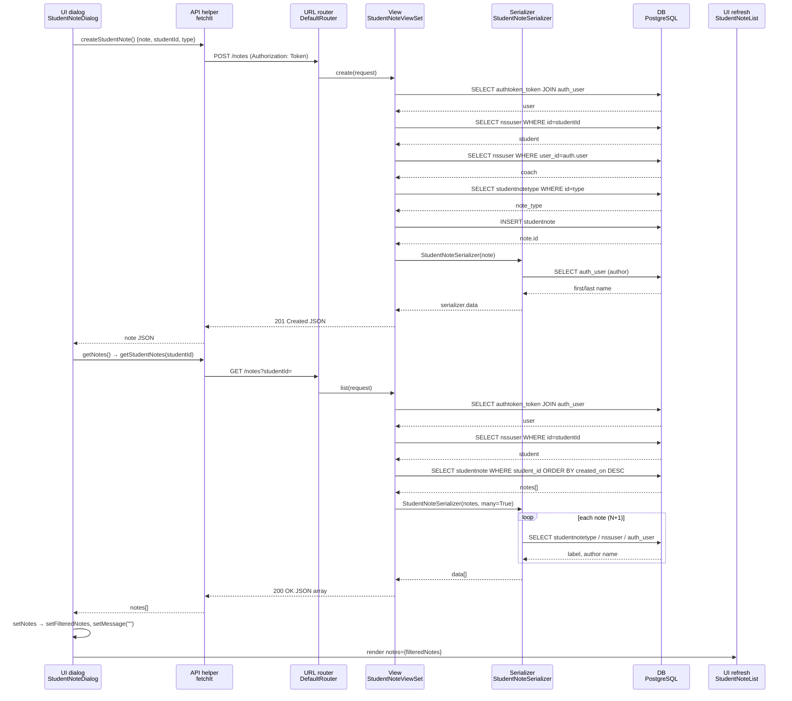

### Trace Notes (AI): notes (learn-ops-api)

Feature: a coach opens the student note dialog, types a note, presses **Enter**, and the list of notes refreshes. The trace covers the `POST /notes` create path, then the `GET /notes?studentId=` refresh.

### Request path table from Claude

| Layer | File | Class / Function | What it does |
|-------|------|-----------------|--------------|
| UI dialog | [learn-ops-client/src/components/dashboard/StudentNoteDialog.js](../learn-ops-client/src/components/dashboard/StudentNoteDialog.js) | `StudentNoteDialog` → `handleNoteKeyDown` / `createStudentNote` | When the coach presses Enter in the note input, it POSTs `{ note, studentId, type }` to `/notes` and chains `getNotes` to refresh the list. |
| API helper | [learn-ops-client/src/components/utils/Fetch.js](../learn-ops-client/src/components/utils/Fetch.js) (also [PeopleProvider.js](../learn-ops-client/src/components/people/PeopleProvider.js) `getStudentNotes`) | `fetchIt` | Wraps `fetch`: adds the `Authorization: Token <token>` header and `Content-Type: application/json`, parses JSON on 200/201, and throws on `reason`/`message` errors. |
| URL router | [learn-ops-api/LearningPlatform/urls.py](../learn-ops-api/LearningPlatform/urls.py) | `router.register(r'notes', views.StudentNoteViewSet, 'note')` | DRF's `DefaultRouter` maps `POST /notes` → `create`, `GET /notes` → `list`, and `DELETE /notes/<pk>` → `destroy` (the inherited `ModelViewSet` version). |
| View | [learn-ops-api/LearningAPI/views/student_note_view.py](../learn-ops-api/LearningAPI/views/student_note_view.py) | `StudentNoteViewSet.create` (and `.list`) | `create` looks up the student, the coach (from the auth token) and the note type, validates the input, builds and saves a `StudentNote`, and returns 201. `list` filters notes by the `studentId` query param. |
| Serializer | [learn-ops-api/LearningAPI/views/student_note_view.py](../learn-ops-api/LearningAPI/views/student_note_view.py) | `StudentNoteSerializer` (nests `StudentNoteTypeSerializer`) | Turns a note into `{id, note, author, note_type:{id,label}, created_on}`. It serializes output only; the view does the validation by hand. |
| DB | [learn-ops-api/LearningAPI/models/people/student_note.py](../learn-ops-api/LearningAPI/models/people/student_note.py) | `StudentNote` model (FKs to `NssUser` ×2 and `StudentNoteType`) | Stores the note row. `author` is a computed property that reads `coach.user.first_name/last_name`, and results are ordered by `-created_on`. |
| UI refresh | [learn-ops-client/src/components/dashboard/StudentNoteDialog.js](../learn-ops-client/src/components/dashboard/StudentNoteDialog.js) → [StudentNoteList.js](../learn-ops-client/src/components/people/StudentNoteList.js) | `getNotes` → `setNotes` → `useEffect` → `setFilteredNotes` → `StudentNoteList` | Re-fetches `/notes?studentId=` and stores the result in state. The effect copies it into `filteredNotes`, which the list renders. Then the input clears (`setMessage("")`). |

#### Database queries

**`POST /notes` (`create`)**
1. `TokenAuthentication`: `SELECT authtoken_token ... JOIN auth_user WHERE key = <token>`
2. `NssUser.objects.get(pk=studentId)`: loads the student
3. `NssUser.objects.get(user=request.auth.user)`: loads the coach
4. `StudentNoteType.objects.get(pk=type)`: loads the note type
5. `note.save()`: `INSERT INTO LearningAPI_studentnote ...`
6. Serializing the response: `author` → `SELECT auth_user` for the coach (the coach NssUser is already cached on the instance)

**`GET /notes?studentId=` (`list`)**
1. Token auth lookup (same as above)
2. `NssUser.objects.get(pk=studentId)`
3. `StudentNote.objects.filter(student=student)`: one query. `len(notes)` in the log line runs it.
4. For **each** note while serializing: `SELECT studentnotetype`, `SELECT nssuser` (coach), and `SELECT auth_user`. This is an **N+1 query pattern**: 1 + 3×N queries. Adding `.select_related('note_type', 'coach__user')` would reduce it to a single query.

#### Observations
- `list` and `create` are overridden, but `destroy` (used by the ✕ button) is the inherited `ModelViewSet.destroy`. It has no logging and no ownership check.
- `create` calls `NssUser.objects.get(pk=request.data['studentId'])` outside a `try`. A missing or invalid `studentId` causes an unhandled `KeyError`/`DoesNotExist`, which returns a 500 instead of a 400.
- `created_on` uses `auto_now=True`, so it changes on every save. `auto_now_add=True` is probably what was intended.
- `logger.info(... data=request.data)` in `create` logs the full note text, which may be sensitive.
- `list` returns a plain array (not paginated), so `getStudentNotes(...).then(setNotes)` works without reading `.results`. By contrast, `/notetypes` is paginated, so the dialog reads `res.results`.

### Sequence Diagram

