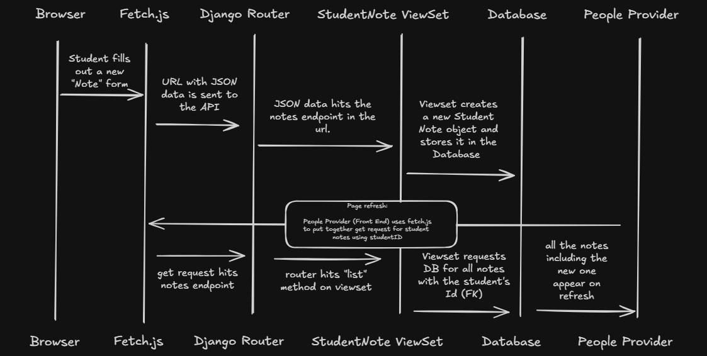

# Trace Notes - Create a Student Note

## Request Path

For each layer of the feature, read through the relevant source code and fill in the class or function name and a short description of what it does in your own words.

| Layer | File | Class / Function | What it does |
|-------|------|-----------------|--------------|
| UI dialog | learn-ops-client/src/components/dashboard/student/StudentNoteDialog.js | createStudentNote() | React gets "Note" from user with useEffect/useState and sends this data to API as a POST request |
| API helper | learn-ops-client/src/components/utils/Fetch.js | fetchIt() | helps parse together the the complete URL for the API request.  |
| URL router | learn-ops-api/LearningPlatform/urls.py | routers.DefaultRouter | DRF built in router that links all requests to a routes URL to its Viewset |
| View | learn-ops/api/LearningAPI/views/student_note_view.py | StudentNoteViewSet | contains all the methods for handling API requests related to Student Notes |
| Serializer |  learn-ops/api/LearningAPI/views/student_note_view.py | StudentNoteSerializer | takes JSON string containing the "Student Note" info and converts it into a python "StudentNote" object that can be stored in the database|
| DB | .env | LEARN_OPS_DB | Postgre SQL database that stores  the newly created "Student Note" along with all other project data |
| UI refresh | PeopleProvider.js | getStudentNotes() | gets all of the notes from the current student including the new one that was just created on page refresh |

## Sequence Diagram

[Excalidraw link] https://excalidraw.com/#json=_gh-tIL30TJE4hDJTX_F_,W-SDBv7uk0mY30S2hn5NRw

